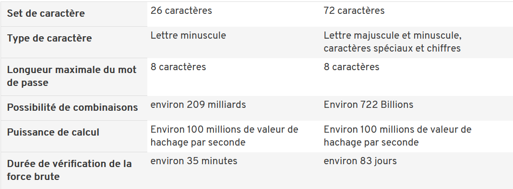
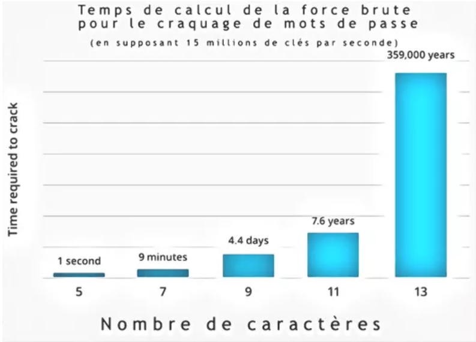

# Bruteforce

L'attaque par bruteforce, ou attaque par force brute, est une méthode de hacking ancienne et simple. Les applications les plus courantes de cette méthodes sont le craquage de mots de passe ou de clés de cryptage. Elle consiste simplement à tester à la suite des combinaisons identifiants/mots de passe jusqu'à trouver la bonne.
Plusieurs approches peuvent être utilisées :

- L'algorithme va tester toutes les combinaisons possibles

La rapidité de l'attaque va donc être dépendante de la puissance de calcul de la machine de l'attaquant, mais surtout de la complexité du mot de passe. C'est pour celà que la majorité des sites web demandent un mot de passe d'au moins 8 caractères, comprenant des majuscules, minuscules, chiffres et caractères spéciaux. Celà augmente grandement le nombre de combinaisons possibles. On peut voir sur les tableaux ci-dessous les effets de la longueur et de la complexité d'un mot de passe :

  
  
   
  <t align="center" style="italic">Rapidité des attaques par bruteforce selon la complexité du mot de passe</t>
  <t align="center" style="italic">Rapidité des attaques par bruteforce selon la complexité du mot de passe</t>
   

- On peut aussi utiliser des dictionnaires de mots de passe

En effet, il est facile de trouver sur internet des dictionnaires des mots de passe les plus utilisés, certains en contiennent des millions. Si votre mot de passe est contenu dans ces dictionnaires, l'attaque peut alors être bien plus rapide.

*Mais alors, quelles sont les mesures à prendre pour se protéger des attaques par bruteforce ?*
1. Tout d'abord, comme nous l'avons vu, choisir un mot de passe long et complexe augmente grandement le nombre de combinaisons possibles.
2. Ensuite, on peut facilement sécuriser le mécanisme d'authentification en le bloquant après X tentatives de connexion infructueuses.
3. L'authentification multifactorielle est aussi utilisée. C'est par exemple lorsqu'on vous demande en plus d'entrer un mot de passe reçu par SMS.

Une attaque par bruteforce est donc facile à mettre en place, mais il est aussi facile de s'en protéger.

## gmailbrute.py

Bruteforcer pour gmail en utilisant le serveur smtp. Cependant, au bout d'un certain nombre de tests, le serveur nous bloque.

*Je me souviens que ce programme marchait à l'époque où j'ai suivi le cours, mais maintenant, après avoir testé avec ma propre addresse mail, il ne fonctionne pas et je n'arrive pas à voir pourquoi...*

**Utilisation :**
Simplement exécuter le programme, il va demander de rentrer l'email à bruteforce et le path vers le fichier contenant les mots de passe à tester (par exemple passwords.txt).
*/!\ Si le programme est exécuté depuis vscode, le répertoire courant est security-course (et non bruteforce). Si on veut utiliser passwords.txt, il faudra alors spécifier le chemin "bruteforce/passwords.txt".*

## websitebruteforcer.py

Programme servant à bruteforce n'importe quelle page de login. Il faut juste adapter les champs en haut du programme pour matcher avec le site voulu. Après, en réalité, les sites nous bloquent après un certain nombre de tentatives.

**Utilisation :**
Exécuter le programme, il va demander l'utilisateur à bruteforcer, et le path vers le fichier contenant les mots de passe à chercher.
Vous pouvez essayer avec **bruteforce/passwords.txt**.
*Pour tester ce programme, j'utilisais une machine virtuelle faisant tourner metasploitable, et notamment DVWA(Damn Vulnerable Web Application). Vous pouvez le trouver ici si vous souhaitez le tester : https://dvwa.co.uk/*

## directories.py

Bruteforce un site web pour trouver les directories du site auxquels on peut accéder.

**Utilisation :**
Exécuter le programme, il va demander l'url à bruteforcer, et le path vers le fichier contenant les directories à tester.
Vous pouvez essayer avec **https://google.com** et le fichier **bruteforce/common.txt**, il va trouver beaucoup de directories.

## subdomains.PY

Idem que le programme précedent mais va chercher les subdomains.

**Utilisation :**
Exécuter le programme, il va demander l'url à bruteforcer, et le path vers le fichier contenant les directories à tester.
Vous pouvez essayer avec **https://google.com** et le fichier **bruteforce/common.txt**, il va trouver beaucoup de subdomains.

## falseheader.py

Ce programme sert à montrer comment modifier nos headers. Il crée simplement un faux header et se connecte au site 'http://httpbin.org/headers qui nous montre nos headers actuels.

On peut alors se faire passer pour une autre machine auprès d'un site web.

**Utilisation :**
Juste exécuter le programme.

